# AWS Identity and Access Management Mini Project

 **AWS Identity and Access Management (IAM)** control who can access what in Amazon Web Services. This project cover users, roles, policies, and groups, and we'll also show you how to set them up to keep your AWS resources safe.

Before we get into all that, let's make sure you understand the basics of cloud computing. "Cloud" is a computer or collection of computers situated somewhere far away and can be accessed over the internet. cloud computing is using the computers over the internet to carryout task which you would normally do if the computer was in front of you, such as storing files (AWS S3 bucket, Azure Blob), running linux commands (EC2, virtual machine), and so on.

**Project Goals:**

  * Understand AWS Identity and Access Management (IAM) principles and components.
  * Learn to create and manage IAM policies for regulating access to AWS resources securely.
  * Apply IAM concepts practically to control access within AWS environments.
  * Explore best practices for IAM implementation and security in AWS.

## What is IAM?

**IAM**, or **Identity and Access Management**, is like the gatekeeper for your AWS resources. Its job is to decide who gets in and what they're allowed to do once they're inside.

Imagine you have this big digital "house" full of all your AWS stuff—your data, your applications, the whole shebang. Now, you don't want just anyone wandering in and messing around with your things, right? That's where IAM steps in.

It's like having your own VIP list for your digital world. IAM helps you keep your AWS resources safe and sound, making sure only the right people get in and that they're only allowed to do what you say they can. It's all about keeping your digital house in order and protecting your precious stuff from any unwanted guests.

> **Note:** AWS resources are the various services and tools provided by Amazon Web Services (AWS) that users can utilize to build and manage their applications and infrastructure in the cloud.

-----

## What is an IAM user?

**IAM users** are like individual accounts for different people or entities within your AWS environment.

For example, if you have a team working on a project, you can create separate IAM users for each team member. Each IAM user would have their own unique username and password, allowing them to access the AWS resources they need for their work.

IAM users help you manage and control access to your AWS resources securely, ensuring that each user only has access to the resources they need to perform their tasks.

-----

## What is an IAM Role?

An IAM role is a container that defines who can assume the role and attaches one or more IAM policies that define what actions can be performed on which resources.

So the policy is what actually defines the permissions, while the role makes those permissions assumable by someone/something.

An IAM policy is like a set of rules (e.g., you can enter the kitchen and bathroom, but not the bedroom).
An IAM role is like a visitor badge with those rules attached. You hand out that badge (role) to someone temporarily (like an app or external user), and the rules (policy) define what they can do while wearing it.

For example, you might have an "admin" role that gives full access to all resources, or a "developer" role that only allows access to certain services for building applications.

Or if we take another example, imagine you have a visitor who needs temporary access to your house to fix something. Instead of giving them a permanent key (IAM user), you give them a temporary key (IAM role) that only works for a limited time and grants access to specific rooms (AWS resources).

IAM roles are flexible and can be assumed by users, services, or applications as needed. They are commonly used for tasks such as granting permissions to AWS services, allowing cross-account access, or providing temporary access to external users. IAM roles enhance security and efficiency by providing controlled access to AWS resources without the need for permanent credentials.

-----

## What is an IAM Policy?

An **IAM policy** is a set of rules that define what actions a role can take. These rules specify the permissions granted to the role. Think of a policy as a rulebook for the role. It outlines which actions are allowed and which are not, helping to ensure secure and controlled access to your AWS resources.

For example, the rulebook might say that the "admin" key (IAM role or user) can open any door and perform any action within the house (AWS resources), while the "viewer" key (IAM role or user) can only open certain doors and look around, but not make any changes.

IAM policies define the permissions granted to IAM roles and users, specifying which AWS resources they can access and what actions they can take. They are essential for maintaining security and controlling access to AWS resources, ensuring that only authorized actions are performed by users and roles within your AWS account.

-----

## What is an IAM group?

**IAM Groups** are like collections of IAM users. Instead of managing permissions for each user individually, you can organize users into groups based on their roles or responsibilities.

You can think of IAM Groups as these neat little collections of users with similar roles or responsibilities. It's like putting everyone into teams based on their tasks. So, you might have a group for developers, another for administrators, and so on. Instead of setting permissions for each person one by one, you set them up for the whole group at once.

For example, let's say you have a development team working on a project. Instead of assigning permissions to each developer one by one, you can create an IAM Group called "Developers" and add all the developers to that group. Then, you assign permissions to the group as a whole. So, if you want all developers to have access to the same resources, you only need to set it up once for the group.

-----

## Best Practices:

*  Give only the permissions needed: Don't give more access than necessary.
*  Use roles instead of users: Roles are safer and can be used when needed.
*  Review roles regularly: Remove unused roles to keep things tidy and secure.
*  Add extra security with MFA: Use Multi-Factor Authentication for extra protection.
*  Use ready-made policies: They're safer and easier to use.
*  Keep policies simple: Make separate policies for different tasks.
*  Keep track of changes: Keep a record of who changes what.
*  Test policies before using them: Make sure they work the way you want them to before applying them to real stuff.
*  Use descriptive names: Choose clear and descriptive names for IAM groups to facilitate understanding and management.
*  Enforce strong password policies: Encourage users to create strong passwords and implement expiration and complexity requirements.

***Note:*** (difference between users and roles)

* In AWS, users are like individual people with their own set of keys to access resources. These keys are permanent and tied to specific individuals. It's similar to having your own key to the front door of your house—it's always yours.

* On the other hand, roles in AWS are more like special keys that can be used by different people or even programs. These keys provide temporary access and can be used by different users as needed. Roles are like master keys that can be used by anyone who needs access to certain things temporarily. So, while users are tied to specific individuals, roles are more flexible and can be shared among different users for specific tasks.

For MFA, you can check out [Multi-Factor Authentication (MFA) for IAM](https://aws.amazon.com/iam/features/mfa/).

Hope you have understood all about IAM. Now, let's get to the practical part.


## Create policy for the Development team

- In the IAM console, click - 

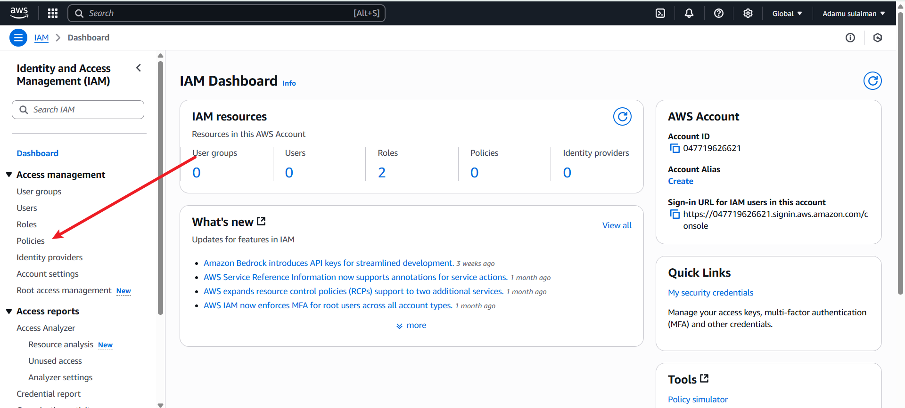

- Click on policy - 

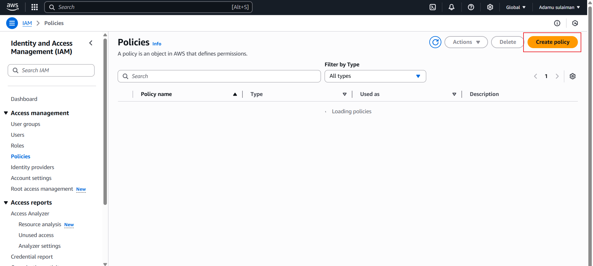

- In the select a service section, search for ec2 - 

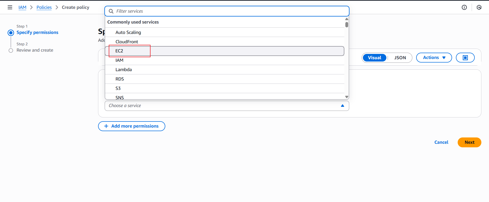

- For simplicity sake, select the *** "All EC2 actions" ***

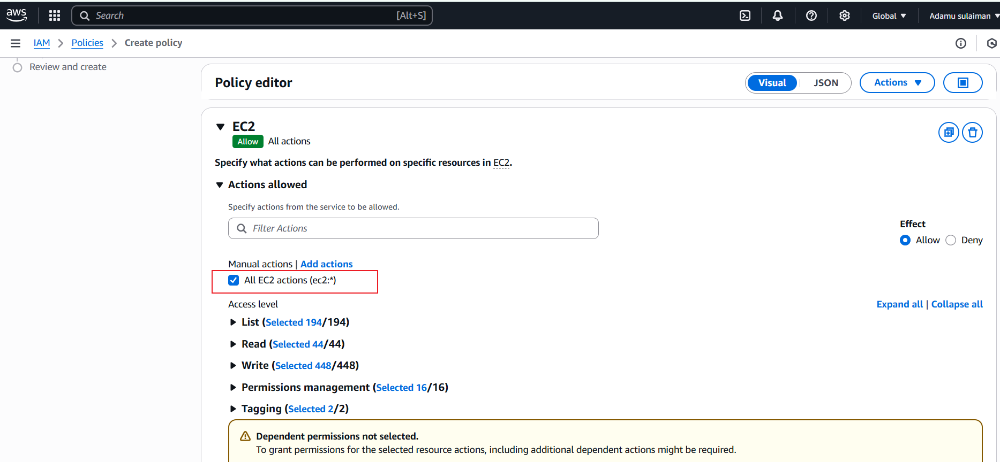

- Click Next

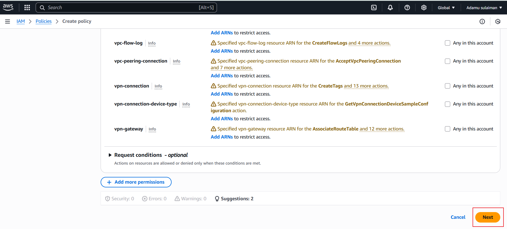

- Types of policies and the name of the one i just created.

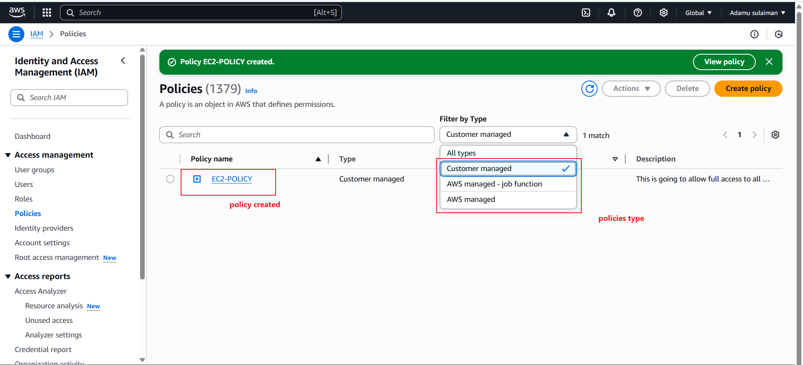

## Create Group for the Development team
- Create a group called ***Backend-Team***

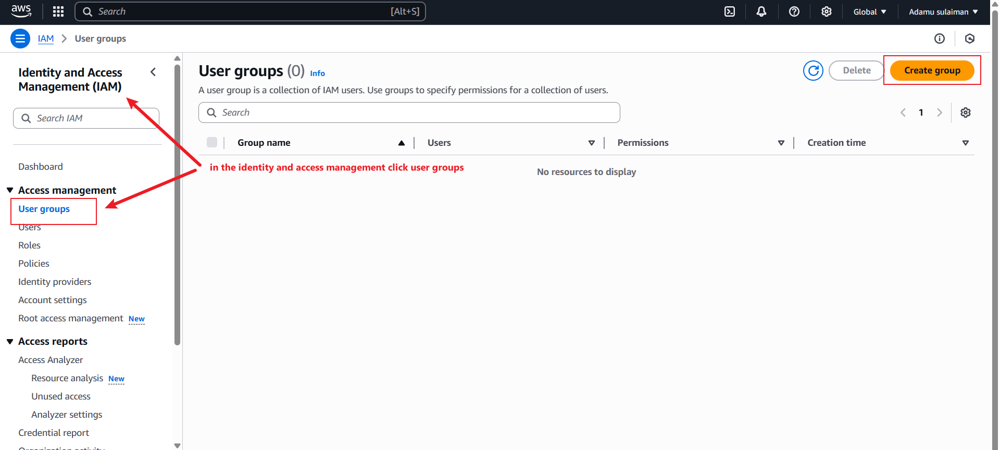


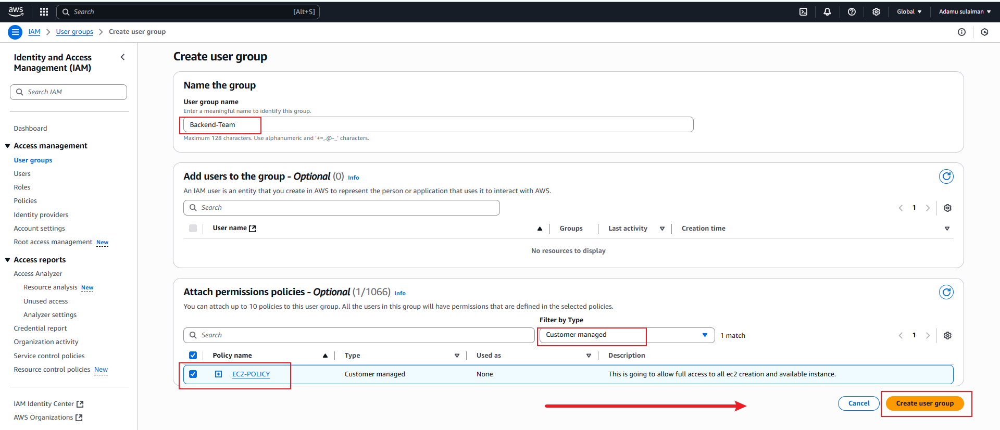

- You have successfully created a group and attached a permission policy for any user added to the group to have access to the EC2 instance only. Recall that users in this group will be backend developer.

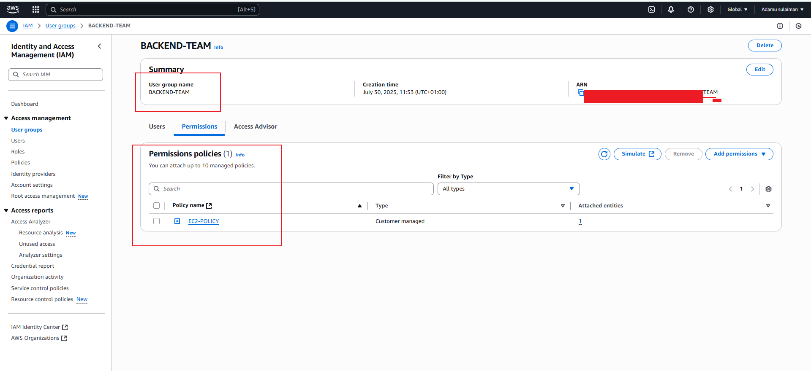


- Create User by Navigating to the IAM dashboard, select "Users" and then click "-
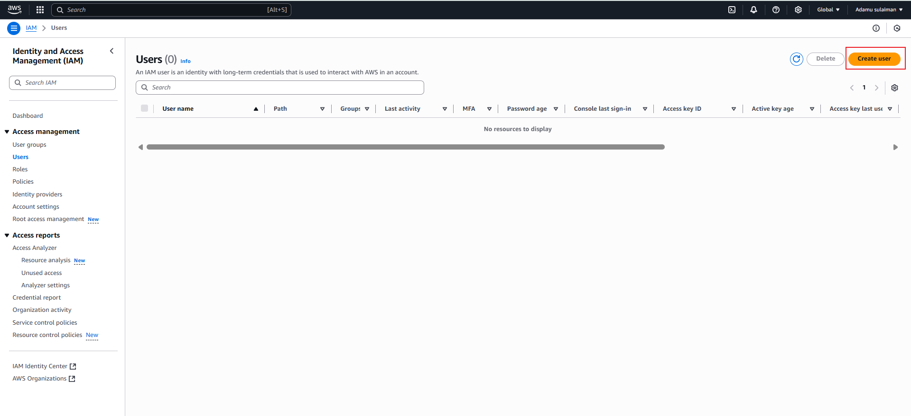

- Provide the name of the user. In this case  ***John***
- Ensure that the user can access the AWS Management Console. If this is not selected, the user will not be able to login from the web browser.

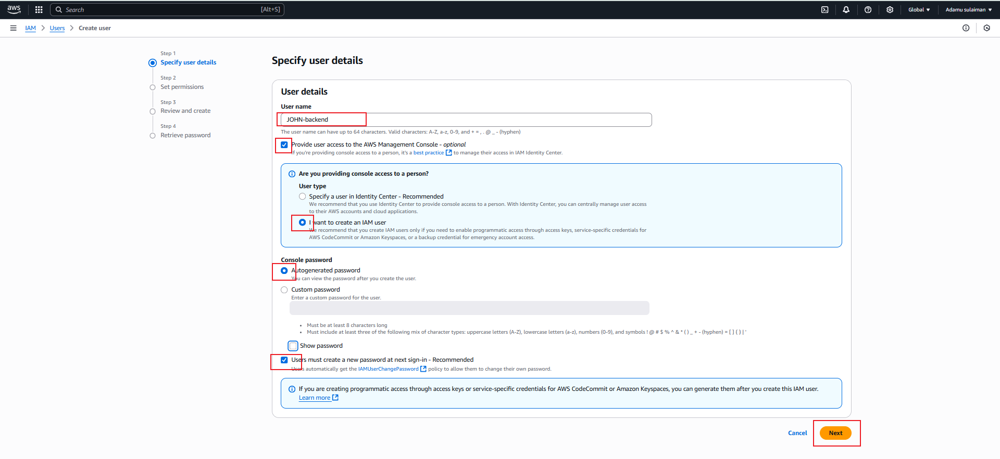

- Permissions: Add the John to the development team group.

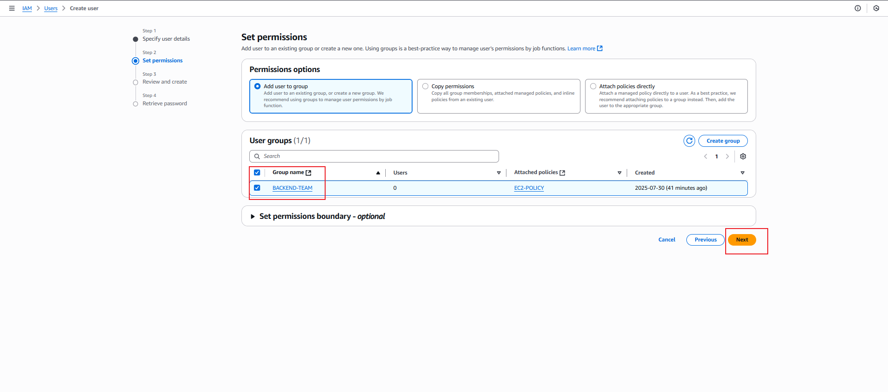

- Click on ***Create us-***

 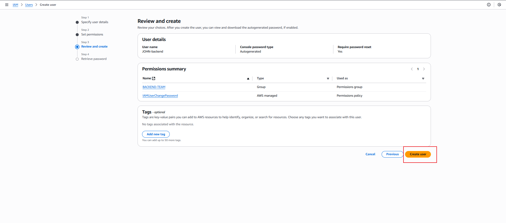

 - Lastly download the .csv file which should contain the default credentials for login, including link, IAM Number, user name and password.

 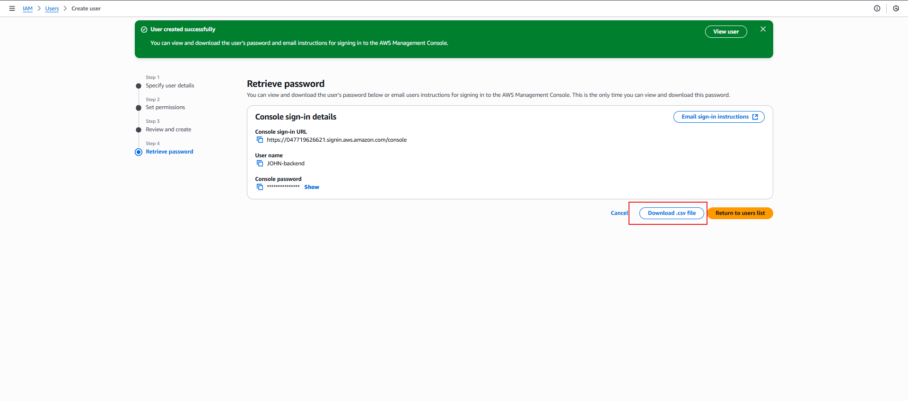

 ## ROLE

  An IAM *** ROLE *** in AWS is a temporary identity that defines what actions are allowed, and who is allowed to use it. 
  An IAM role in AWS is a temporary identity that defines:

      - What actions are allowed (through permission policies), and

      - Who is allowed to use it (through a trust policy).

Unlike IAM users, a role does not have permanent passwords or access keys.
Instead, it provides temporary access credentials — which include an access key, secret key, and a session token — that are generated and managed by AWS STS (Security Token Service). this session expires with time.

We will create a role and make it trust an EC2 instance (an amazon service)
```
                                                              amazon services
                                                        **************************
                trust         ++++++++++++++           |            EC2           |            
IAM USER <--------------------|             |          |                          |
                              |      IAM    |  trust   |          AWS LAMBDA      |
                              |             |--------->|                          |
                       trust  |      ROLE   |          | AMAZON ELASTIC CONTAINER |
IAM EXTERNAL ACCOUNT <--------|             |          |                          |
                              +++++++++++++++          |         E.T.C.           |
                                     .                  **************************
                                     .
                                     .  trust
                                     .
                                    \/
                                  ANOTHER ROLE
```


### PRACTICAL CREATION ON ROLE AND TRUST.
Trust is simply the service, external aws account, user or anything that can access the permissions in our ROLE.
Trust has to be definded in the trust policy and permissions are provide in the permission policy while creating the ROLE.

- select role from IAM side bar and click on create role
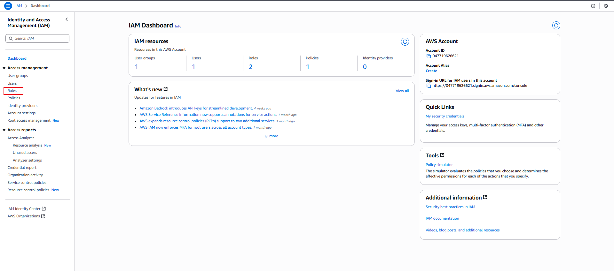

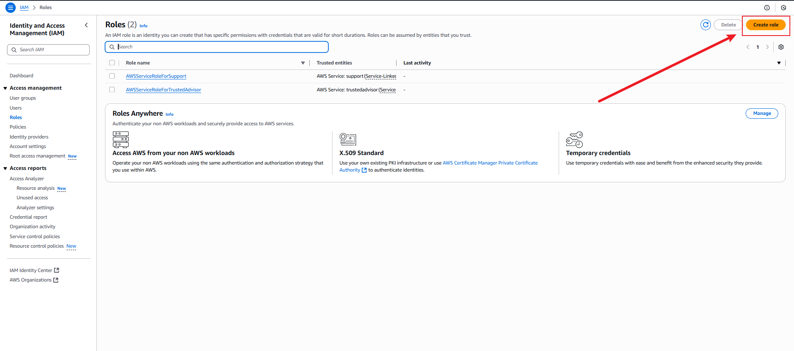

- create trust by choosing from the six possible trustees.
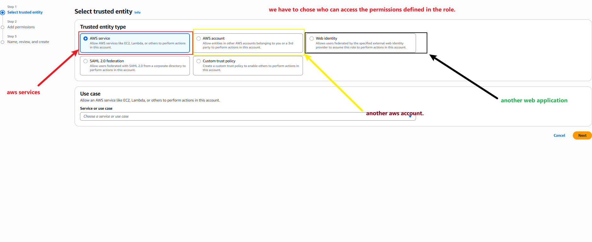

- our trust in this case is an EC2 instance which is a service. click the search box, search for the service, select it and click next.

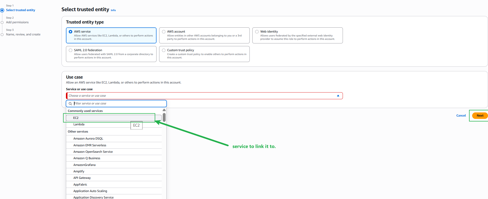

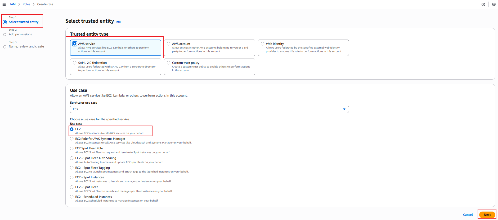

- Create the permission for the role, here we will just create permission for an S3 bucket.

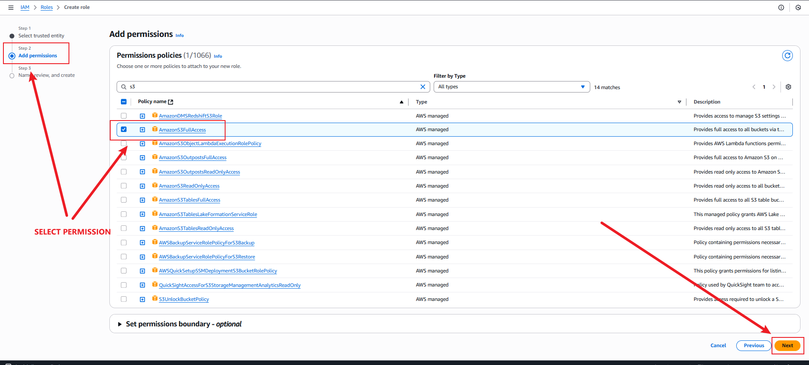

- review all the permission and name the ROLE.


- viewing permissions of the role

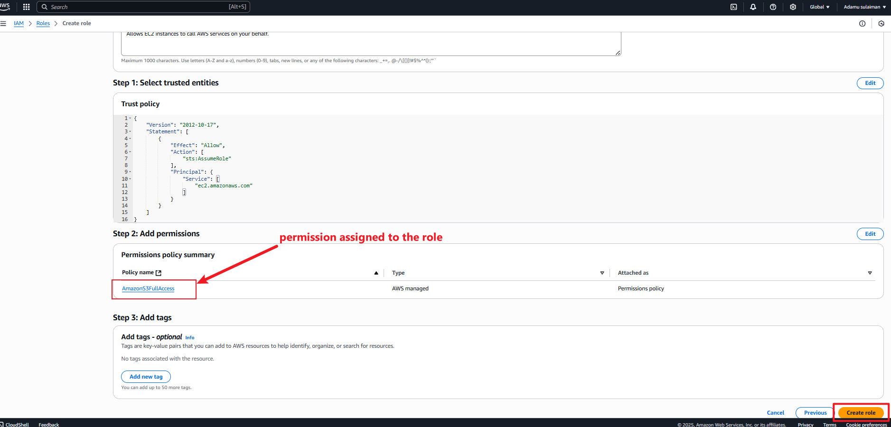

- Attach the created role to an existing EC2, the trust policy was that any EC2 can connect have access to s3 buckets as long as it has this role attach to it. so lets attach this role to it.


- select the role to attach to the EC2 


- confirm role attachment since this is your first time.

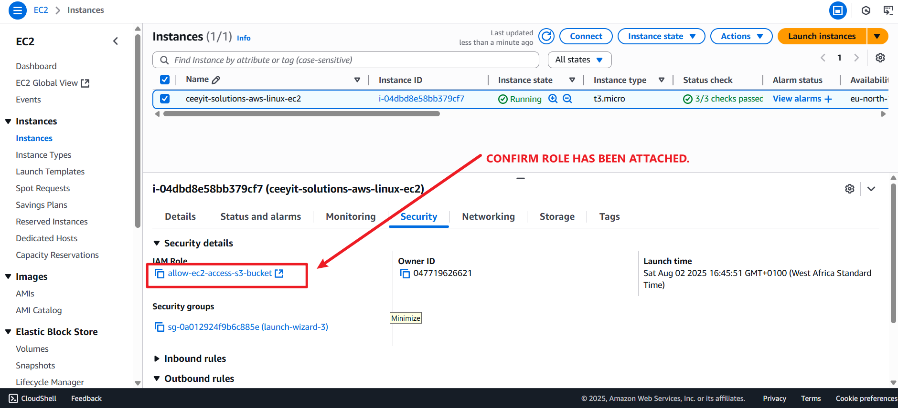

- delete role

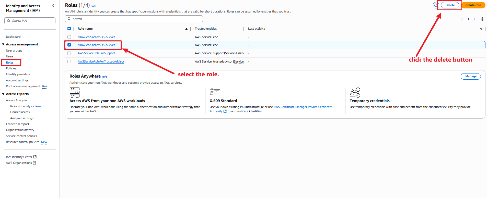


## Project reflection:

  * **Understanding IAM:** IAM serves as the security foundation for AWS resources, controlling access and permissions.
  * **Security Importance:** IAM ensures data protection, compliance, and prevents unauthorized access.
  * **Policy Creation:** Participants learned to craft IAM policies to regulate resource access effectively.
  * **Practical Application:** Hands-on exercises equipped participants to set up IAM users, groups, and roles, enhancing their real-world IAM implementation skills.